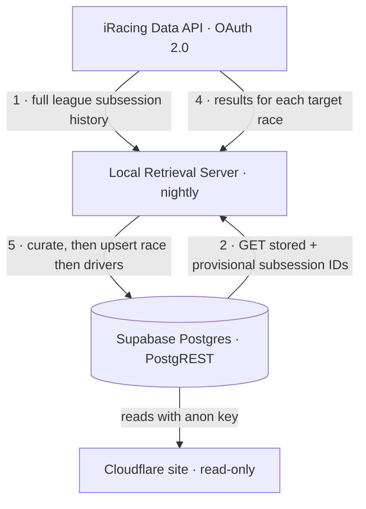

# ATC Retrieval Server

A small server that runs **locally on a home network** and keeps the ATC iRacing
league site (hosted on Cloudflare) supplied with race data.

Its whole reason to exist: **iRacing login credentials never leave the home
network.** The public site on Cloudflare holds the results database but has no
iRacing credentials. This local server is the only component that talks to
iRacing, and it pushes results up to the remote — a one-way sync.

## How it works

The server runs as a **nightly job** (`src/sync_races.py`). Each run reconciles what
iRacing has for the league against what the site's database already stores,
**curates** the results down to a display-ready shape, and uploads that.

The site's database is a **Supabase** Postgres. Supabase auto-generates a REST
API (PostgREST) over it, so the retrieval server writes **directly to Supabase**
using the secret **service-role key** (which bypasses Row-Level Security) — there
is no custom endpoint on the Cloudflare site. The public site reads the curated
tables with the anon key.



1. **Fetch the full history from iRacing.** Authenticate to iRacing and walk
   every league season (retired ones included) to collect every completed
   race's `subsession_id`. A "race ID" in iRacing *is* a `subsession_id`.
2. **Ask Supabase what it has.** `GET /rest/v1/curated_races?select=subsession_id`.
3. **Pick this run's targets.** Two groups:
   - **missing** — in the iRacing history, absent from `curated_races`;
   - **provisional** — already stored, still `status = 'provisional'`, and
     started within the refresh window (30 days by default). A race a steward
     marked `final` is never re-fetched, and neither is an old provisional one.
4. **Fetch results for the targets.** For each `subsession_id`, pull its full
   results document from iRacing (`results/get`).
5. **Curate, then upsert.** `curate.py` trims each document into one
   `curated_races` header row plus one `curated_race_results` row per driver.
   The race row is written **first** (the results table has an FK to it), then
   the driver rows.

## What the server writes — and what it deliberately doesn't

The **raw iRacing payload is never stored.** iRacing is itself the durable
archive — any subsession is re-fetchable — so keeping a local copy of the
`cust_id`-laden blob was a redundant second copy of the one thing that carries
personal data. The pre-2026-07 raw `races` table was dropped in ATCWeb's
`0004_curated_races.sql`; this server curates on ingest instead.

The server writes the **baseline only**. Three columns are owned by the web
app's admin page and are **absent from every payload this server sends**:

| Column | Owner | Why the server omits it |
|---|---|---|
| `curated_races.status` | web app | DB default is `provisional` on insert; omitting it means a re-sync can't demote a steward-finalized race. |
| `curated_race_results.penalty_points` | web app | Applied aggregate of the `penalties` table. Sending it would wipe applied penalties on the next sync. |
| `curated_race_results.adjusted_position` | web app | Recomputed in TypeScript after penalties are applied. |

That works because PostgREST's `resolution=merge-duplicates` only updates the
columns actually present in the request body. So a re-run refreshes the baseline
(name, car, positions, interval, incidents) and leaves steward work untouched.
**Adding any of those three fields to a payload would silently undo penalties.**

Two more conversions worth knowing, both in `curate.py`:

- **Positions are 0-based in iRacing, 1-based in the DB.** The winner finishes
  `0` upstream and is stored as `1`. A `starting_position` of `-1` (no
  qualifying) becomes null.
- **`interval` passes through verbatim**, including `-1` (a lap or more down).
  It's ten-thousandths of a second behind the class leader, and the web app
  re-sorts on it after applying penalties, so it is never normalized here.

iRacing's `champ_points` / `league_points` are ignored — ATC scores with its own
external tool.

Because everything is keyed on the natural keys (`subsession_id`, and
`subsession_id + cust_id`), runs are **idempotent**: a night with no new races
re-pulls only recent provisional ones, and a re-run never duplicates data.

**Skips.** A subsession with no `Race` simsession (practice/qualify only) isn't a
race and is skipped. So is one missing a value for a NOT NULL column
(`start_time`, `track_name`, `display_name`, `finish_position`, `cust_id`) —
skipping the whole subsession keeps a half-written race out of the DB rather than
failing the batch. Every skip is logged with its reason.

### The non-race cache (`state/non_races.json`)

**106 of this league's 336 subsessions are practice-only.** They never land in
`curated_races`, so they look "missing" on every run — without help, the nightly
job would re-download all 106 forever, which is most of its work.

So a skip that is **structurally permanent** (no `Race` simsession, or a race
with no finishers — neither can change for a completed subsession) is recorded
in `state/non_races.json` and never fetched again. A skip that might be an
upstream hiccup (a missing NOT NULL value, a malformed payload) is **not**
cached, so it retries next run.

The file is git-ignored, derived, and safe to delete — that just costs one slow
run to rebuild. Dry runs never write it.

Worth noting what *doesn't* work here: the `league/season_sessions` listing looks
like it should identify races up front, but the closest it offers is
`race_laps`/`race_length`, and sampling found a real race with both set to `0`.
Filtering on that would silently drop races, so the cache is keyed on the
observed result instead — a verdict is only recorded after actually seeing the
payload.

## Add-only — the sync never deletes

The sync only ever inserts or updates. There is **no delete code path anywhere** —
`supabase_client.py` exposes only reads and upserts, no `DELETE`. So a row that
exists in Supabase but is **not** in the iRacing history is never touched by this
server.

That reverse case — present in the DB, absent from iRacing — is called an
**extra**. The sync detects extras (`stored_ids − iRacing_ids`) and **records them
in the log** for visibility, but deliberately leaves them in place. They might be
manual entries, retired/renamed sessions, or data owned by the website side, so
removing them is never this job's call.

Never deleting is load-bearing here, not just caution: the `penalties` table has
an `ON DELETE CASCADE` foreign key to `curated_race_results`, so deleting a
driver's result row would silently destroy that driver's steward penalty history.

**Known gap:** extras are detected at race level only. If a *re-fetched* race
stops listing a driver (an iRacing result correction, say), that driver's row
survives untouched and nothing flags it — detecting it would mean reading back
each refreshed race's existing rows to diff them. Rare enough to leave for now;
worth knowing before trusting a driver count blindly.

## Run logs

Every run appends a block to **`logs/sync.log`** (created on first run;
git-ignored — it's local operational history, not code). Each block records the
run timestamp, the counts, every race written
(**subsession_id · start_time · track_name**), anything skipped and why, and any
extras detected:

```
================================================================
Sync run: 2026-07-25 14:30:02 UTC  (league 6243)
  iRacing history:                336
  Already in curated_races:       335
  New races uploaded:             1
  Provisional refreshed:          2 (started within 30 days)
  Driver rows written:            61
  Skipped (not curatable):        1
  Known non-races (not fetched):  106
  Extras (in DB, not on iRacing): 0
----------------------------------------------------------------
New races uploaded  (subsession_id | start_time | track_name):
  37135346 | 2021-01-29T00:00:47Z | [Retired] Charlotte Motor Speedway
----------------------------------------------------------------
Provisional races refreshed (baseline re-pulled; penalties and adjusted
positions untouched):
  37135102 | 2026-07-18T23:00:00Z | Okayama International Circuit
----------------------------------------------------------------
Skipped subsessions (nothing written for these):
  ! 37135290 - no 'Race' simsession (practice/qualify only)
----------------------------------------------------------------
ADD-ONLY: no rows were deleted; no extra rows detected in Supabase.
================================================================
```

A failed run is logged too, so the file is a complete history of what the nightly
job did.

## Authentication (iRacing OAuth 2.0)

iRacing retired the old email/password cookie auth (the legacy `POST /auth`
endpoint now returns `405`). This server uses the **OAuth 2.0 "Password Limited
Grant"** — the grant intended for unattended clients acting on behalf of a
registered user.

- **Token endpoint:** `POST https://oauth.iracing.com/oauth2/token`
  (`grant_type=password_limited`, scope `iracing.auth`, form-encoded).
- **Requires four secrets:** the user's `email` + `password` **and** an
  iRacing-issued `client_id` + `client_secret`. The OAuth client is registered
  by contacting iRacing.
- **Secret masking:** both the client secret and the password are sent as
  `base64(sha256(secret + identifier.strip().lower()))` — `client_secret` keyed
  by `client_id`, `password` keyed by the `email`.
- **Tokens are short-lived** (~10 min) and come with a refresh token; the client
  refreshes automatically during a run.

Data requests go to `https://members-ng.iracing.com/data/...` with an
`Authorization: Bearer <access_token>` header. Every `/data` endpoint returns a
signed link that must be followed for the real payload (large payloads arrive as
numbered chunk files); the client handles both.

## Configuration

All secrets live in `config/config.json`. It is **git-ignored** and Claude is
**denied read access** to it (`.claude/settings.json`), so credentials stay off
both git and the assistant. Copy `config/config.example.json` to
`config/config.json` and fill it in.

```json
{
  "iracing": {
    "email": "your-iracing-login-email@example.com",
    "password": "your-iracing-password",
    "client_id": "your-oauth-client-id",
    "client_secret": "your-oauth-client-secret"
  },
  "leagueId": 6243,
  "refreshWindowDays": 30,
  "supabase": {
    "url": "https://mysupabaseurl.supabase.co",
    "service_role_key": "your-service-role-key"
  }
}
```

| Field | What it is |
|-------|-----------|
| `iracing.email` / `iracing.password` | Your iRacing login. |
| `iracing.client_id` / `iracing.client_secret` | OAuth client credentials issued by iRacing (Password Limited Grant). |
| `iracing.scope` | *(optional)* OAuth scope; defaults to `iracing.auth`. |
| `leagueId` | Numeric league ID. Found in the league URL on the iRacing site (`.../League.do?league=XXXXX`). Currently `6243` (ATC). |
| `refreshWindowDays` | *(optional, default 30)* How far back to re-pull races still marked `provisional`. Bigger = more iRacing calls per night; `0` effectively makes the sync add-only. |
| `supabase.url` | The site's Supabase project URL. |
| `supabase.service_role_key` | **Secret.** Supabase → Project Settings → API → `service_role`. Bypasses RLS so the sync can write. Keep it only in `config.json`. |

## Project layout

| Path | Status | Purpose |
|------|--------|---------|
| `src/iracing_client.py` | ✅ built | Reusable iRacing client: OAuth auth + refresh, Bearer data requests, signed-link/chunk following, rate-limit handling, and `get_subsession_result(subsession_id)` → full `results/get` document for one race. |
| `src/fetch_race_ids.py` | ✅ built | `fetch_league_subsession_ids(client, league_id)` — walks the full league history and returns every `subsession_id` as an in-memory `list[int]`. |
| `src/curate.py` | ✅ built | Pure transform (no I/O): one iRacing document → one `curated_races` row + N `curated_race_results` rows. Owns the 0-based→1-based position shift and the "never emit web-app columns" rule. Raises `SkipRace` for non-races and incomplete data. |
| `src/supabase_client.py` | ✅ built | Supabase/PostgREST client: paged reads, `upsert_curated_races()` / `upsert_curated_race_results()` (service-role key). No `DELETE`, by design. |
| `src/sync_races.py` | ✅ built | The nightly job: fetch → pick targets → curate → upsert race then drivers. `--dry-run` curates without writing. |
| `config/config.json` | you provide | Secrets + league ID + Supabase (git-ignored, Claude-denied). |
| `config/config.example.json` | ✅ built | Template for `config/config.json`. |
| `requirements.txt` | ✅ built | Python dependencies (`requests`). |
| `logs/sync.log` | ✅ auto | Persistent append-only run log (git-ignored): one block per run — races written, skips with reasons, and any extras detected. Created on first run. |
| `state/non_races.json` | ✅ auto | Git-ignored cache of practice-only subsessions, so they aren't re-fetched nightly. Derived; safe to delete. |
| `UPLOAD_SERVER_MIGRATION.md` | ✅ written | The cross-repo brief for this migration, from the ATCWeb side. |
| *ATCWeb* `supabase/migrations/0004_curated_races.sql` | ✅ written | Creates `curated_races`, `curated_race_results`, `penalties`, the public `race_results` view, and **drops the old `races` table**. The schema is a cross-repo contract — a column rename there silently breaks this server. |
| `run_sync.bat` | ✅ built | Windows Task Scheduler wrapper; tees console output to `logs/scheduler.out`. |

## Setup & running

Requires Python 3.11+ (developed on 3.14).

```powershell
pip install -r requirements.txt

# Print the full league subsession-ID history (sorted list[int])
python src/fetch_race_ids.py

# Curate 3 races against live iRacing data and print the exact payloads.
# Writes nothing, logs nothing — the safe way to check the pipeline.
python src/sync_races.py --dry-run
python src/sync_races.py --dry-run=10

# Nightly sync: curate and push races to Supabase
python src/sync_races.py
```

A dry run authenticates, fetches and curates for real — only the writes are
skipped — so it's the way to confirm the transform against actual iRacing
payloads before anything touches the database. It also tolerates the curated
tables not existing yet, so it works before `0004` has been applied.

The only things written to disk are the run log and the non-race cache, both
git-ignored and both rebuildable. `fetch_league_subsession_ids()` returns the IDs
in memory; `sync_races.py` curates and upserts.

**Before `sync_races.py` can run**, two one-time prerequisites:

1. **Apply the migration.** Run `supabase/migrations/0004_curated_races.sql`
   against the Supabase project (SQL editor, or `supabase db push` from ATCWeb)
   so the curated tables exist.
2. **Add the service-role key** to `config/config.json` under `supabase` (see
   [Configuration](#configuration)).

### One-time cutover

`0004_curated_races.sql` drops the old raw `races` table on its way in, so the
whole league history gets re-pulled from iRacing — which is fine, iRacing is the
archive.

1. `python src/sync_races.py --dry-run` — check the curated payloads against real
   iRacing data. Works before the migration is applied.
2. Apply `0004_curated_races.sql`.
3. `python src/sync_races.py` — backfills the full history (~336 races, so this
   run is much slower than a normal night).
4. **Verify:**
   - `curated_races` has one row per subsession, all `status = 'provisional'`;
   - `curated_race_results` has one row per driver in the Race simsession;
   - `finish_position` is 1-based — a winner shows `1`, not `0`;
   - `starting_position` is null where iRacing had `-1`;
   - `GET /rest/v1/race_results` with the **anon** key returns rows and contains
     **no `cust_id`**;
   - `GET /rest/v1/curated_race_results` with the anon key returns nothing.
5. Set a `penalty_points` by hand, then re-run the sync and confirm it survives.

## Scheduling (nightly)

On Windows, a Task Scheduler task running `run_sync.bat` nightly is the intended
trigger. The wrapper resolves its own repo path and tees output to
`logs/scheduler.out`, so uncaught failures are captured even headless.

## Still open / owned elsewhere

Everything below is the **web app's**, not this server's — listed so the boundary
stays clear:

- **Penalties.** Entered on the admin page as points in the `penalties` table.
  This server never touches `penalties`, `penalty_points`, or
  `adjusted_position`.
- **Points→time conversion and the position re-sort.** The web app owns the
  points-to-seconds mapping (deliberately not in the DB) and recomputes
  `adjusted_position` in TypeScript.
- **Season linking.** `curated_races.season_id` stays null here; the web app
  links races to its own `seasons` table.
- **Championship scoring.** The external ATC scoring tool.
- **Roster linking.** iRacing gives `cust_id` + `display_name`; joining `cust_id`
  to the site's `drivers` roster is the web app's job. `cust_id` is internal — it
  is never exposed to anon, which is why the public read path is the
  `race_results` view.

## Security notes

- `config/config.json` is git-ignored and never committed.
- Claude cannot read `config/config.json` (denied in `.claude/settings.json`).
- Credentials are read only at runtime and are never logged.
- iRacing credentials exist **only** on this local machine — never on Cloudflare.
