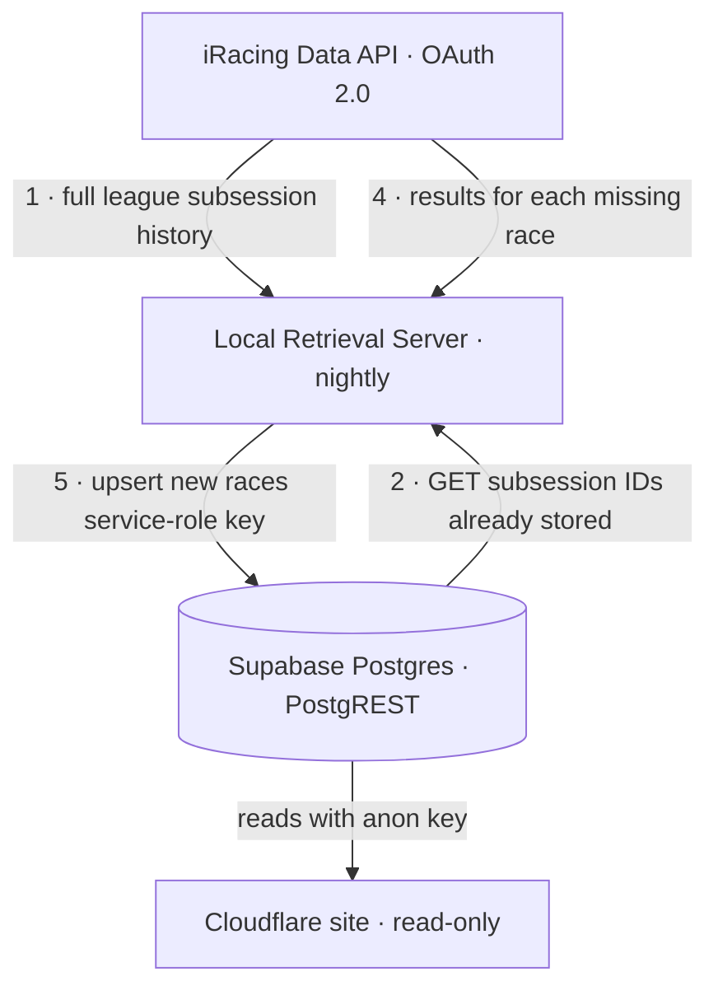

# ATC Retrieval Server

A small server that runs **locally on a home network** and keeps the ATC iRacing
league site (hosted on Cloudflare) supplied with race data.

Its whole reason to exist: **iRacing login credentials never leave the home
network.** The public site on Cloudflare holds the results database but has no
iRacing credentials. This local server is the only component that talks to
iRacing, and it pushes results up to the remote — a one-way sync.

## How it works

The server runs as a **nightly job** (`sync_races.py`). Each run reconciles what
iRacing has for the league against what the site's database already stores, and
uploads only the difference.

The site's database is a **Supabase** Postgres. Supabase auto-generates a REST
API (PostgREST) over it, so the retrieval server writes **directly to Supabase**
using the secret **service-role key** (which bypasses Row-Level Security) — there
is no custom endpoint on the Cloudflare site. The public site just reads the same
tables with the anon key.



1. **Fetch the full history from iRacing.** Authenticate to iRacing and walk
   every league season (retired ones included) to collect every completed
   race's `subsession_id`. A "race ID" in iRacing *is* a `subsession_id`.
2. **Ask Supabase what it has.** `GET /rest/v1/races?select=subsession_id` — the
   subsession IDs already stored.
3. **Diff.** `missing = iRacing_subsession_ids − stored_subsession_ids`. If
   nothing is missing, the run ends here.
4. **Fetch results for the missing races.** For each missing `subsession_id`,
   pull its full results document from iRacing (`results/get`).
5. **Upsert.** `POST /rest/v1/races` with the service-role key, merging on
   `subsession_id`, storing each full results document losslessly as `jsonb`.

Because the sync is keyed on `subsession_id` and only ever adds what's missing,
runs are **idempotent** — a night with no new races is a no-op, and a re-run
never duplicates data.

**Schema scope:** the `races` table is a deliberately minimal *raw landing*
table — `subsession_id`, `league_id`, `start_time`, `track_name`, and the full
iRacing `results` document as `jsonb`. Any normalized/display schema (per-driver
results, standings, roster linking) is owned by the website side and built on top
of this jsonb later.

## Add-only — the sync never deletes

The sync only ever **adds** what iRacing has and Supabase is missing: it computes
`missing = iRacing_ids − stored_ids` and upserts those. There is **no delete code
path anywhere** — `supabase_client.py` exposes only reads and an upsert, no
`DELETE`. So a row that exists in Supabase but is **not** in the iRacing history
is never touched by this server.

That reverse case — present in the DB, absent from iRacing — is called an
**extra**. The sync detects extras (`stored_ids − iRacing_ids`) and **records them
in the log** for visibility, but deliberately leaves them in place. They might be
manual entries, retired/renamed sessions, or data owned by the website side, so
removing them is never this job's call.

## Run logs

Every run appends a block to **`logs/sync.log`** (created on first run;
git-ignored — it's local operational history, not code). Each block records the
run timestamp, the counts, every new race uploaded
(**subsession_id · start_time · track_name**), and any extras detected:

```
================================================================
Sync run: 2026-07-25 14:30:02 UTC  (league 6243)
  iRacing history:       336
  Already in Supabase:   335
  Uploaded this run:     1
  Extras (in DB, not on iRacing): 0
----------------------------------------------------------------
New races uploaded  (subsession_id | start_time | track_name):
  37135346 | 2021-01-29T00:00:47Z | [Retired] Charlotte Motor Speedway
----------------------------------------------------------------
ADD-ONLY: no rows were deleted; no extra rows detected in Supabase.
================================================================
```

A failed run is logged too, so the file is a complete history of what the nightly
job did.

## Authentication (iRacing OAuth 2.0)

iRacing retired the old email/password cookie auth (the legacy `POST /auth`
endpoint now returns `405`). This server uses the **OAuth 2.0 "Password Limited
Grant"** — the grant intended for unattended clients acting on behalf of a
registered user.

- **Token endpoint:** `POST https://oauth.iracing.com/oauth2/token`
  (`grant_type=password_limited`, scope `iracing.auth`, form-encoded).
- **Requires four secrets:** the user's `email` + `password` **and** an
  iRacing-issued `client_id` + `client_secret`. The OAuth client is registered
  by contacting iRacing.
- **Secret masking:** both the client secret and the password are sent as
  `base64(sha256(secret + identifier.strip().lower()))` — `client_secret` keyed
  by `client_id`, `password` keyed by the `email`.
- **Tokens are short-lived** (~10 min) and come with a refresh token; the client
  refreshes automatically during a run.

Data requests go to `https://members-ng.iracing.com/data/...` with an
`Authorization: Bearer <access_token>` header. Every `/data` endpoint returns a
signed link that must be followed for the real payload (large payloads arrive as
numbered chunk files); the client handles both.

## Configuration

All secrets live in `config/config.json`. It is **git-ignored** and Claude is
**denied read access** to it (`.claude/settings.json`), so credentials stay off
both git and the assistant. Copy `config/config.example.json` to
`config/config.json` and fill it in.

```json
{
  "iracing": {
    "email": "your-iracing-login-email@example.com",
    "password": "your-iracing-password",
    "client_id": "your-oauth-client-id",
    "client_secret": "your-oauth-client-secret"
  },
  "leagueId": 6243,
  "supabase": {
    "url": "https://mysupabaseurl.supabase.co",
    "service_role_key": "your-service-role-key"
  }
}
```

| Field | What it is |
|-------|-----------|
| `iracing.email` / `iracing.password` | Your iRacing login. |
| `iracing.client_id` / `iracing.client_secret` | OAuth client credentials issued by iRacing (Password Limited Grant). |
| `iracing.scope` | *(optional)* OAuth scope; defaults to `iracing.auth`. |
| `leagueId` | Numeric league ID. Found in the league URL on the iRacing site (`.../League.do?league=XXXXX`). Currently `6243` (ATC). |
| `supabase.url` | The site's Supabase project URL. |
| `supabase.service_role_key` | **Secret.** Supabase → Project Settings → API → `service_role`. Bypasses RLS so the sync can write. Keep it only in `config.json`. |

## Project layout

| Path | Status | Purpose |
|------|--------|---------|
| `src/iracing_client.py` | ✅ built | Reusable iRacing client: OAuth auth + refresh, Bearer data requests, signed-link/chunk following, rate-limit handling, and `get_subsession_result(subsession_id)` → full `results/get` document for one race. |
| `src/fetch_race_ids.py` | ✅ built | `fetch_league_subsession_ids(client, league_id)` — walks the full league history and returns every `subsession_id` as an in-memory `list[int]`. |
| `src/supabase_client.py` | ✅ built | Supabase/PostgREST client: `get_existing_subsession_ids()` and `upsert_races(rows)` (service-role key). |
| `src/sync_races.py` | ✅ built | The nightly job: fetch → diff → fetch results → upsert missing races. |
| `config/config.json` | you provide | Secrets + league ID + Supabase (git-ignored, Claude-denied). |
| `config/config.example.json` | ✅ built | Template for `config/config.json`. |
| `requirements.txt` | ✅ built | Python dependencies (`requests`). |
| `logs/sync.log` | ✅ auto | Persistent append-only run log (git-ignored): one block per run — uploaded races (subsession_id · start_time · track_name) and any extras detected. Created on first run. |
| `../ATCWeb/supabase/migrations/0003_races.sql` | ✅ written | The `races` landing table. Must be **applied** to Supabase and pushed to ATCWeb. |
| *scheduler* | ⏳ planned | Nightly trigger (e.g. Windows Task Scheduler). |

## Setup & running

Requires Python 3.11+ (developed on 3.14).

```powershell
pip install -r requirements.txt

# Print the full league subsession-ID history (sorted list[int])
python src/fetch_race_ids.py

# Nightly sync: push any races missing from Supabase
python src/sync_races.py
```

Nothing is written to disk — this server keeps no long-term local state.
`fetch_league_subsession_ids()` returns the IDs in memory; `sync_races.py`
diffs them against Supabase and upserts the missing races.

**Before `sync_races.py` can run**, two one-time prerequisites:

1. **Apply the migration.** Run `supabase/migrations/0003_races.sql` against the
   Supabase project (Supabase SQL editor, or `supabase db push` from ATCWeb) so
   the `races` table exists, and push it to the ATCWeb repo.
2. **Add the service-role key** to `config/config.json` under `supabase` (see
   [Configuration](#configuration)).

## Scheduling (nightly)

Not wired up yet. On Windows, a Task Scheduler task running
`python src/sync_races.py` nightly is the intended trigger.

## Still open / owned elsewhere

- **Display/normalized schema.** The `races` table is raw landing only. Per-driver
  results, standings, and roster linking are owned by the website side, built on
  top of the `results` jsonb.
- **Roster linking.** iRacing gives `cust_id` + `display_name`; linking to the
  site's `drivers` roster (e.g. adding `iracing_cust_id` to `drivers`) is deferred.

## Security notes

- `config/config.json` is git-ignored and never committed.
- Claude cannot read `config/config.json` (denied in `.claude/settings.json`).
- Credentials are read only at runtime and are never logged.
- iRacing credentials exist **only** on this local machine — never on Cloudflare.
