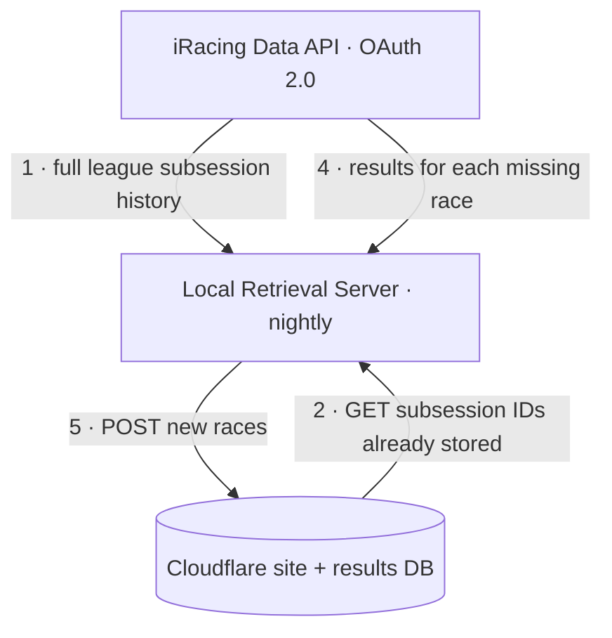

# ATC Retrieval Server

A small server that runs **locally on a home network** and keeps the ATC iRacing
league site (hosted on Cloudflare) supplied with race data.

Its whole reason to exist: **iRacing login credentials never leave the home
network.** The public site on Cloudflare holds the results database but has no
iRacing credentials. This local server is the only component that talks to
iRacing, and it pushes results up to the remote — a one-way sync.

## How it works

The server runs as a **nightly job**. Each run reconciles what iRacing has for
the league against what the remote database already stores, and uploads only the
difference.



1. **Fetch the full history from iRacing.** Authenticate to iRacing and walk
   every league season (retired ones included) to collect every completed
   race's `subsession_id`. A "race ID" in iRacing *is* a `subsession_id`.
2. **Ask the remote what it has.** `GET` the list of `subsession_id`s already
   stored in the Cloudflare database.
3. **Diff.** `missing = iRacing_subsession_ids − remote_subsession_ids`. If
   nothing is missing, the run ends here.
4. **Fetch results for the missing races.** For each missing `subsession_id`,
   pull its results from iRacing (finishing order, incidents, laps, etc.).
5. **Push.** `POST` the new races to the remote so the Cloudflare site can serve
   them.

Because the sync is keyed on `subsession_id` and only ever adds what's missing,
runs are **idempotent** — a night with no new races is a no-op, and a re-run
never duplicates data.

## Authentication (iRacing OAuth 2.0)

iRacing retired the old email/password cookie auth (the legacy `POST /auth`
endpoint now returns `405`). This server uses the **OAuth 2.0 "Password Limited
Grant"** — the grant intended for unattended clients acting on behalf of a
registered user.

- **Token endpoint:** `POST https://oauth.iracing.com/oauth2/token`
  (`grant_type=password_limited`, scope `iracing.auth`, form-encoded).
- **Requires four secrets:** the user's `email` + `password` **and** an
  iRacing-issued `client_id` + `client_secret`. The OAuth client is registered
  by contacting iRacing.
- **Secret masking:** both the client secret and the password are sent as
  `base64(sha256(secret + identifier.strip().lower()))` — `client_secret` keyed
  by `client_id`, `password` keyed by the `email`.
- **Tokens are short-lived** (~10 min) and come with a refresh token; the client
  refreshes automatically during a run.

Data requests go to `https://members-ng.iracing.com/data/...` with an
`Authorization: Bearer <access_token>` header. Every `/data` endpoint returns a
signed link that must be followed for the real payload (large payloads arrive as
numbered chunk files); the client handles both.

## Configuration

All secrets live in `config.json` at the project root. It is **git-ignored** and
Claude is **denied read access** to it (`.claude/settings.json`), so credentials
stay off both git and the assistant. Copy `config.example.json` to `config.json`
and fill it in.

```json
{
  "iracing": {
    "email": "your-iracing-login-email@example.com",
    "password": "your-iracing-password",
    "client_id": "your-oauth-client-id",
    "client_secret": "your-oauth-client-secret"
  },
  "leagueId": 6243
}
```

| Field | What it is |
|-------|-----------|
| `iracing.email` / `iracing.password` | Your iRacing login. |
| `iracing.client_id` / `iracing.client_secret` | OAuth client credentials issued by iRacing (Password Limited Grant). |
| `iracing.scope` | *(optional)* OAuth scope; defaults to `iracing.auth`. |
| `leagueId` | Numeric league ID. Found in the league URL on the iRacing site (`.../League.do?league=XXXXX`). Currently `6243` (ATC). |

> **Planned additions** (for the remote sync, once that contract is defined):
> a remote base URL and an API key/token for authenticating local → remote
> `GET`/`POST` calls. See [Open questions](#open-questions-remote-sync).

## Project layout

| Path | Status | Purpose |
|------|--------|---------|
| `iracing_client.py` | ✅ built | Reusable iRacing client: OAuth auth + refresh, Bearer data requests, signed-link/chunk following, rate-limit handling. |
| `fetch_race_ids.py` | ✅ built | Walks the full league history and writes every `subsession_id` to `data/race_ids.json`. |
| `config.json` | you provide | Secrets + league ID (git-ignored, Claude-denied). |
| `config.example.json` | ✅ built | Template for `config.json`. |
| `requirements.txt` | ✅ built | Python dependencies (`requests`). |
| `data/` | generated | Fetched output (git-ignored). |
| *remote sync* | ⏳ planned | `GET` existing IDs, diff, fetch results, `POST` missing races. |
| *results fetch* | ⏳ planned | `results/get?subsession_id=…` per missing race. |
| *scheduler* | ⏳ planned | Nightly trigger (e.g. Windows Task Scheduler). |

## Setup & running

Requires Python 3.11+ (developed on 3.14).

```powershell
pip install -r requirements.txt

# One-off: dump the full league subsession-ID history to data/race_ids.json
python fetch_race_ids.py
```

`data/race_ids.json` contains a flat, chronologically sorted `subsession_ids`
array plus a `races` list with per-race metadata (season, launch time, session
name).

Nightly scheduling and the full sync entry point are not built yet — see below.

## Open questions (remote sync)

The remote half of the sync still needs decisions before it's built:

- **Remote endpoints:** URL(s) for `GET` existing `subsession_id`s and `POST`
  new races.
- **Local → remote auth:** shared API key / token, and where it's stored
  (`config.json`).
- **POST payload:** raw iRacing `results/get` JSON, or a transformed/trimmed
  shape the site expects? Per-race or batched?
- **Failure handling:** if a `POST` fails mid-run, is the next night's diff
  enough to recover (idempotent retry), or is per-race acknowledgement needed?

## Security notes

- `config.json` is git-ignored and never committed.
- Claude cannot read `config.json` (denied in `.claude/settings.json`).
- Credentials are read only at runtime and are never logged.
- iRacing credentials exist **only** on this local machine — never on Cloudflare.
